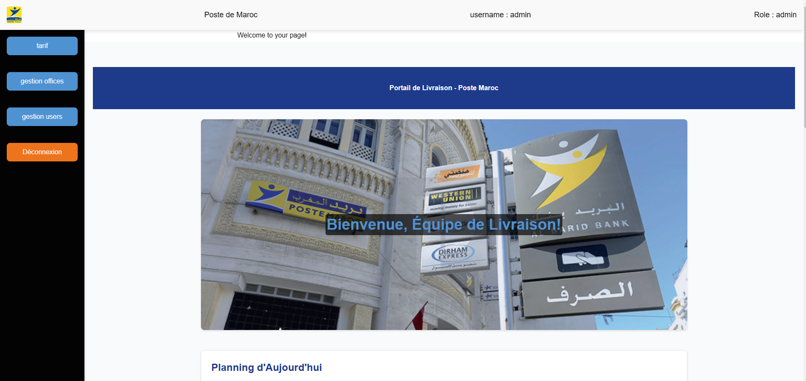

# Poste de Maroc Unified Interface Project

## Project Overview

Welcome to the repository for my internship project at Poste de Maroc! This project aims to address a key issue that employees have been facing: the need to use two separate interfaces for "courrier" and "colis," each requiring separate authentication and accounts. This setup has led to inefficiencies and confusion.

## Goals

The main goal of this project is to develop a unified interface that:

1. **Streamlines Authentication**
   - A single, secure login process granting access to both the "courrier" and "colis" functionalities.

2. **Enhances Functionality**
   - **Courrier Interface**:
     - Tailored for handling documents and papers.
     - Offers a cost-effective and slower delivery option.
   - **Colis Interface**:
     - Designed for physical products.
     - Provides a faster but more expensive delivery solution.

Each interface will feature unique pricing and weight specifications to meet the diverse needs of our clients.

## Timeline

This project will be developed over the course of my one-month internship at Poste de Maroc.

## Progress Updates

I will be documenting my progress and any significant milestones here. Stay tuned for updates!

## Collaborators

- **GitHub Username:** sifeddineEddr  
  **Full Name:** Sifeddine Eddarai  
  **Email:** sifeddine.edr@gmail.com  

- **GitHub Username:** ayoubmajid67  
  **Full Name:** Ayoub Majid  
  **Email:** ayoubmajid71@gmail.com  

- **GitHub Username:** mehdch22  
  **Full Name:** Mehdi Chhoubi  
  **Email:** mehdismeex@gmail.com  

## Tech

**Front-End:**
- HTML
- CSS
- JavaScript

**Back-End:**
- Python
- Django
- MySQL

**Environment:**
- Postman
- Insomnia
- VSCode
- Git/GitHub

## Contact

For any inquiries or feedback, please reach out to me at ayoubmajid71@gmail.com.

## Tags

`#Internship` `#PosteDeMaroc` `#DigitalTransformation` `#TechInnovation` `#EmployeeInterface` `#Courrier` `#Colis`

